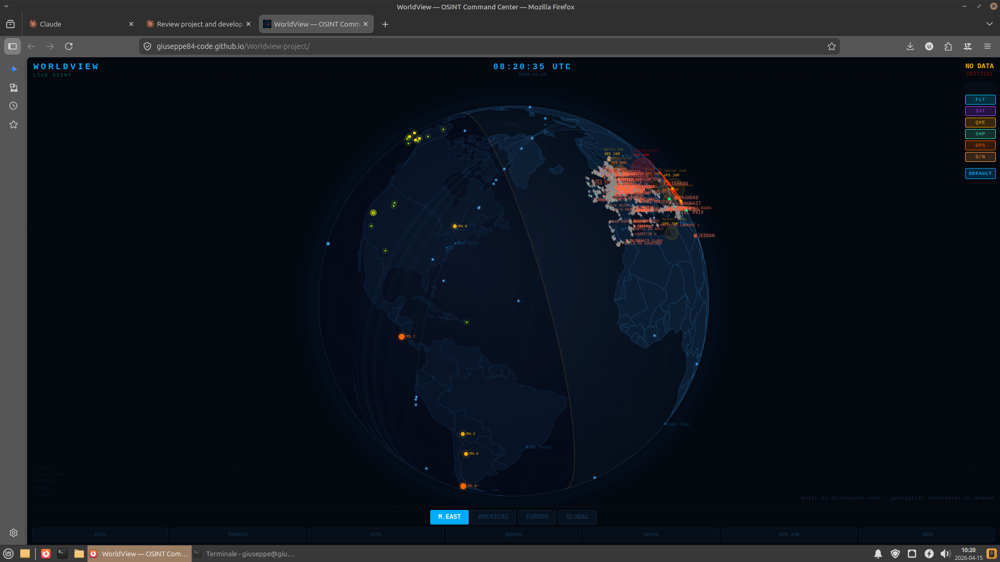

# WorldView — Geospatial OSINT Command Center


A real-time situational-awareness dashboard that aggregates public feeds — flights, vessels, satellites, earthquakes, GPS-jamming zones — onto a single orthographic globe. Runs entirely in the browser, installable as a PWA, no backend.

**Live demo:** https://giuseppe84-code.github.io/Worldview-project/
**Consulting pitch:** https://giuseppe84-code.github.io/Worldview-project/landing.html

<!-- Add hero screenshot here: docs/hero.png -->


---

## The Problem

OSINT practitioners, maritime-security analysts, and newsroom researchers need to correlate multiple real-time geospatial feeds to assess what's happening in a region **right now**. The existing tooling has two failure modes:

- **Enterprise stacks** (Flightradar24, MarineTraffic, Palantir-class platforms) are expensive, siloed per-domain, and require seat licences or server deployment.
- **Hobbyist tools** on GitHub typically pick one source (flights *or* ships) and present it as a raw data table, not a geospatial picture.

There was no middle ground: a lightweight, mobile-friendly, multi-source situational view that a solo analyst could install on a phone and open during an incident.

## The Approach

Build a single-page client app that does three things well:

1. **Projects an interactive globe** with first-class mobile touch (drag, pinch, tap) and desktop keyboard controls.
2. **Aggregates free public feeds in real time** — ADS-B, AIS, orbital elements, USGS seismic — each with its native cadence (stream vs poll).
3. **Renders the entire HUD on a single Canvas** fed by a deterministic animation loop, so performance stays flat even with thousands of entities in view.

No backend. No auth. No database. The whole product is a ~85 kB gzipped JavaScript bundle served as a static site.

## Key Technical Decisions

### 1. D3 orthographic projection on Canvas, not Mapbox / Leaflet

**Rationale.** Mapbox and Leaflet assume a Mercator world with tile layers. The product needs a 3D-looking globe that gracefully handles antimeridian crossings and poles, and it needs to render 500+ animated markers at 60 fps on a phone. Tiles would cost bandwidth, network trips, and memory; SVG DOM would choke on the marker count.

**Trade-off accepted.** No built-in raster basemap. Country borders come from a TopoJSON file (`world-atlas`, ~100 kB) decoded client-side — good enough for geopolitical context, no satellite imagery. If a client ever needs imagery, swap in a pre-rendered equirectangular texture sampled in the fragment pipeline.

### 2. Client-only architecture

**Rationale.** Every candidate data source exposes CORS-friendly REST or WebSocket endpoints. Removing the backend eliminates hosting cost, auth surface, and most of the operational risk. It also makes the codebase re-usable as a white-label asset: drop in a different set of feed URLs, rebuild, ship.

**Trade-off accepted.** API keys for services that require them (aisstream.io) live in `localStorage` — users supply their own. This is fine for an analyst-grade tool; for a multi-tenant SaaS it would need a proxy.

### 3. WebSocket for AIS, polling for everything else

**Rationale.** AIS positions change every few seconds; a vessel seen once and then missed for 30 s is useless. `aisstream.io` exposes a bbox-filtered WebSocket that streams only the region in view. Flights from OpenSky, satellites from CelesTrak, and quakes from USGS update on the order of minutes — polling with a background interval is simpler and kinder to their rate limits.

**The hard part: binary frames.** `aisstream.io` serves the subscription over WSS but delivers payloads as **binary** (Blob or ArrayBuffer), not text. The initial naive handler (`typeof ev.data === "string"`) silently dropped every frame. Fixed by forcing `ws.binaryType = "arraybuffer"`, decoding with `TextDecoder("utf-8")`, and routing both text and binary paths through a shared `processMsg` pipeline. A diagnostic sub-panel (Shift+D) surfaces per-counter metrics — `parseErr`, `binary`, `apiError`, `handlerErr` — so future edge cases are self-reporting instead of silent.

### 4. Reconnection + watchdog

Long-lived WebSockets die in the wild: phones suspend, proxies idle out, networks flap. The AIS client tracks `lastMsgAt`; a 10 s watchdog forces a reconnect if no frame has arrived in 45 s. Reconnect uses exponential backoff capped at 30 s. Reliable on mobile networks.

### 5. PWA with network-first HTML, cache-first hashed assets

**Rationale.** Field analysts lose connectivity. The service worker caches the last successful HTML and all hashed JS/CSS, so the app launches offline. New deploys are picked up instantly because HTML uses `network-first` with a cache fallback — whichever bundle the fresh HTML references wins.

Live data feeds are explicitly **never** cached (would serve stale positions).

### 6. CI/CD via GitHub Actions → `gh-pages`

Every push to `main` triggers a workflow that runs `npm ci && npm run build` and publishes `dist/` to the `gh-pages` branch via `peaceiris/actions-gh-pages`. Concurrency-gated so overlapping deploys cancel the older run. Zero manual steps; the feature-branch → PR → merge → live flow is ~60 seconds.

### 7. LocalStorage for user state

Region selection, visual filter, ship-type filter, AIS key — all persist across reloads. Cheap, no sync server needed, works offline.

## Results

| Metric | Value |
|---|---|
| JS bundle (gzipped, first load) | ~84 kB (3 chunks: React 45 kB + D3 21 kB + app 17 kB) |
| JS re-download after app update | ~17 kB (vendor chunks cached) |
| Cold load on 4G | < 2 s |
| Live marker budget at 60 fps | 500+ on mid-tier Android |
| Concurrent feeds | 5 (ADS-B poll, AIS stream, satellites poll, quakes poll, TopoJSON) |
| Static asset count | 9 (HTML + 4 JS chunks + CSS + 3 icons) |
| Backend | None |
| Monthly infra cost | $0 (GitHub Pages) |

## Features in Production

- Orthographic globe with touch-drag rotation, pinch/wheel zoom, keyboard controls (arrows, ±, /, Esc, 1-4 region switch, F filter cycle)
- Live ADS-B flight tracking with military-callsign highlighting and 15-second refresh
- Live AIS vessels via streaming WebSocket, with per-type filter badges (NAVAL / TANKER / CARGO / PASSENGER / OTHER), heading vectors, and type-based coloring
- Real satellite orbital propagation from CelesTrak GP elements (Kepler + J2)
- USGS earthquake feed with magnitude-scaled markers
- Published GPS-jamming zones overlay
- Visual filters: NVG, FLIR, SIGINT, default — different color palettes for different analytic contexts
- Day/night terminator, UTC clock, region bounding boxes for Middle East, Americas, Europe, Global
- Search bar for countries, cities, military airbases, high-value targets
- Mobile-first responsive UI with PWA install prompt and offline fallback

## Stack

React 18 · Vite · D3.js (`geoOrthographic`) · Canvas 2D · WebSocket · Service Worker · GitHub Actions

## Running Locally

```bash
npm install
npm run dev            # dev server on http://localhost:5173
npm run build          # production bundle in dist/
```

For live AIS data, get a free API key at [aisstream.io](https://aisstream.io) and paste it into the VESSELS panel — it's stored only in your browser's `localStorage`.

## Data Sources

| Source | Feed | Cadence |
|---|---|---|
| [OpenSky Network](https://opensky-network.org/) | ADS-B flights | 15 s poll |
| [aisstream.io](https://aisstream.io) | AIS vessel positions | WebSocket stream |
| [CelesTrak](https://celestrak.org/) | Satellite orbital elements | 5 min poll |
| [USGS](https://earthquake.usgs.gov/) | Seismic events | 2 min poll |
| [world-atlas](https://github.com/topojson/world-atlas) | Country borders (TopoJSON) | On load |

All data is public OSINT. Not certified for operational use.

## About

Built by [Giuseppe84-code](https://github.com/Giuseppe84-code). Available for custom geospatial / real-time-data dashboards — maritime security, conflict monitoring, newsroom tooling, internal SOC visualisation. Open a GitHub issue or reach out via the profile above.

## License

MIT
